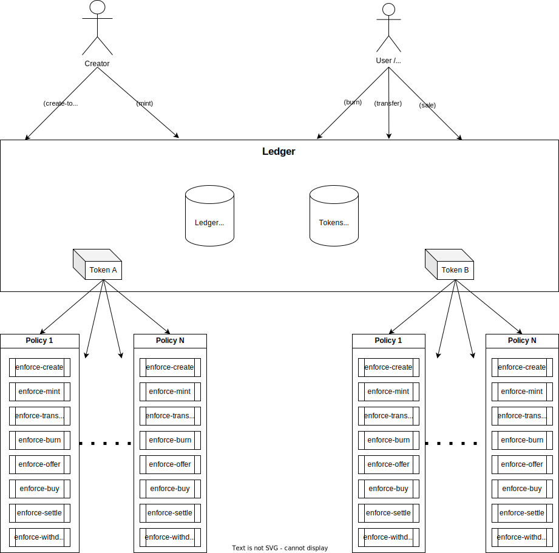
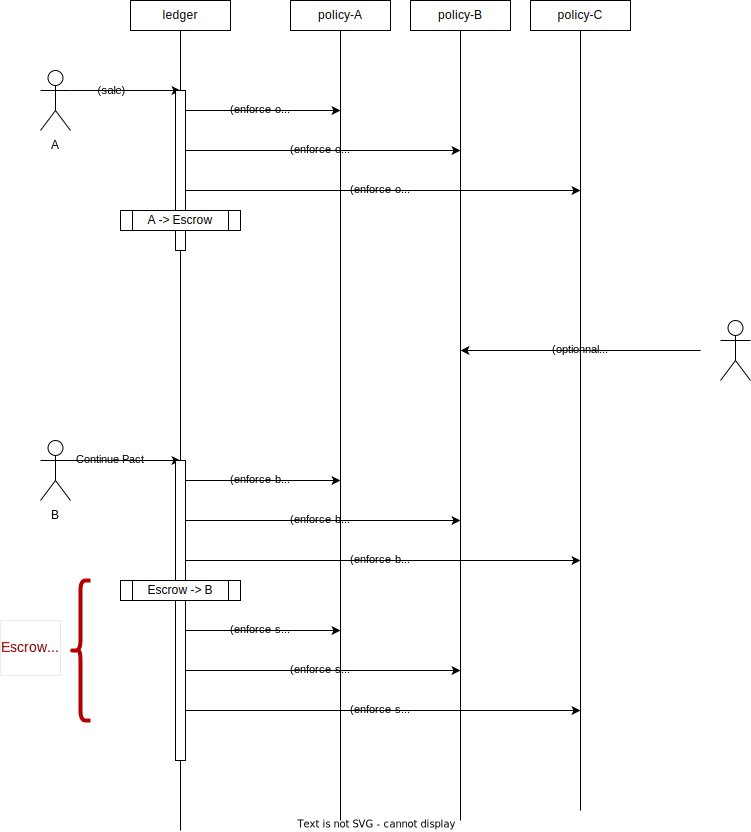
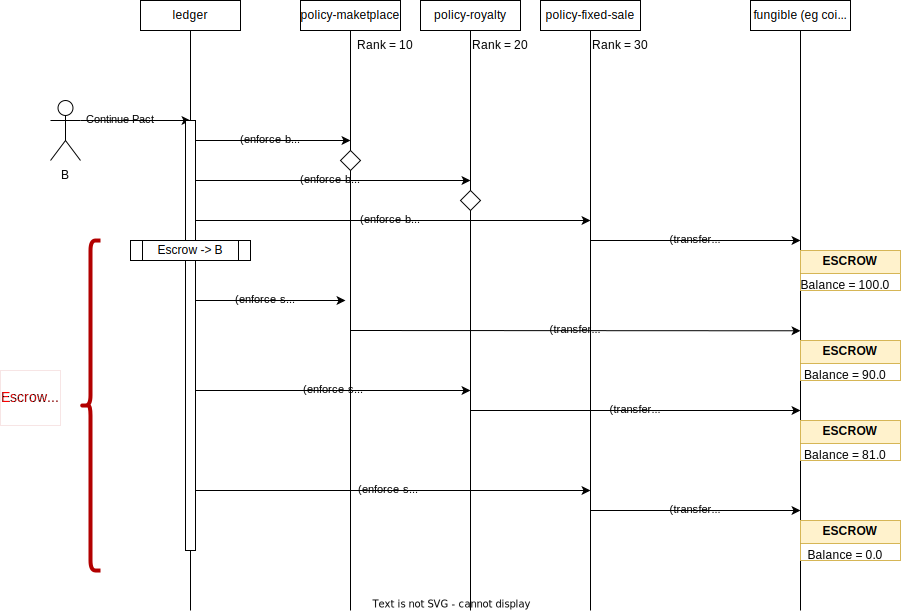

Concepts and architecture
=========================

Architecture
------------
The central part of Marmalade-NG is the ledger module:
  - Store the tokens parameters
  - Store the accounts data: balance, guards...
  - Manages all the accounts/tokens operations: mint/burn/transfer/sale
  - Call the policies declared by tokens via modrefs.
  - Manage the security of escrow accounts.

Marmalade-V2 contains 15 standard policies that can be declared by tokens.

Every policy has a static dependency on the ledger:
  - For security: The policies need to refer to the ledger capabilities.
  - Some policies need some functions declared by the ledger for doing some basic account management, like retrieving guards, creating accounts.

Moreover, Marmalade-NG includes two (not mandatory to use) libraries:
  - std-policies: A set of pure functions that help to work with policies as strings.
  - util-policies: A set of functions that must be used for policy development only.

Security Model
--------------

The security model of Marmalade-NG is based on the following principles.

Simplicity
~~~~~~~~~~
The architecture model is simple.
It leaves only the minimum possible in the ledger module.

There are no associated centralized ``policy-manager`` or ``quote-manager`` as in Marmalade V2:
   - All circular dependencies are avoided.
   - Avoid multiplying Single Points of Failure with added complexity.

Most of the business logic resides in policies.

Policies isolation
~~~~~~~~~~~~~~~~~~
Thanks to Pact capabilities, all policies and hooks inside are isolated from each other.
   - Prevent cross-tokens calls
   - Prevent cross-policies calls
   - Prevent cross-hooks calls within a single policy

All the standards policies use the same paradigm: avoid any dependencies between policies.
As a rule of thumb, policies must stay independent of each other without the need to use external data from other policies.

This guarantees that most bugs and possible security breaches inside a policy (even a custom one) will have a limited range and limited exploitability.

Sales escrow account
~~~~~~~~~~~~~~~~~~~~
During a sale, escrow accounts are necessary.
The Marmalade-NG architecture provides a suitable framework for policies to deal with such accounts.

The architecture try to reduce as much as possible the code range where debiting escrow accounts is possible.
This has been done by breaking the *buy operation* into 2 steps.

Front-running considerations
~~~~~~~~~~~~~~~~~~~~~~~~~~~~
In Maramalade-NG, front-running attacks that could lead to a loss of funds or a Denial of Service are considered.

Especially these two critical cases are considered:
  - tokens creation
  - collections creation

Token IDs
---------
The primary key to identify tokens is the token-id.

This ID always starts with a "t:" and is a hash of the concatenation of:
   - The URI of the NFT
   - A creation guard

The creation guard may be a key, but also another (well protected) guard when a token is created by a contract.

The creation guard prevents front-running and ensures that only the legit creator will be able to create a token with a given token-id.

The token-id can be pre-generated by calling ``(ledger.create-token-id)``

Policies
--------
When created, the token must *subscribe* to a list of policies.

These policies can be:
  - standard policies
  - custom policies

A policy is a Pact helper module that will be called at each step of the life of the token. A policy must implement the token-policy interface.

.. code:: lisp

   (interface token-policy-v2

     (defschema token-info
       id:string
       supply:decimal
       precision:integer
       uri:string
     )

     (defun rank:integer ()
       @doc "Returns the rank of the policy"
     )

     (defun enforce-init:bool (token:object{token-info})
       @doc "Enforce policy on TOKEN initiation."
     )

     (defun enforce-mint:bool (token:object{token-info} account:string amount:decimal)
       @doc "Minting policy for TOKEN to ACCOUNT for AMOUNT."
     )

     (defun enforce-burn:bool (token:object{token-info} account:string amount:decimal)
       @doc "Burning policy for TOKEN to ACCOUNT for AMOUNT."
     )

     (defun enforce-transfer:bool (token:object{token-info} sender:string receiver:string amount:decimal)
       @doc "Enforce rules on transfer of TOKEN AMOUNT from SENDER to RECEIVER"
     )

     (defun enforce-sale-offer:bool (token:object{token-info} seller:string amount:decimal timeout:time)
       @doc "Offer policy by SELLER of AMOUNT of TOKEN."
     )

     (defun enforce-sale-withdraw:bool (token:object{token-info})
       @doc "Withdraw policy by SELLER of AMOUNT of TOKEN"
     )

     (defun enforce-sale-buy:bool (token:object{token-info} buyer:string)
       @doc "Buy policy to BUYER AMOUNT of TOKEN."
     )

     (defun enforce-sale-settle:bool (token:object{token-info})
       @doc "Settle of TOKEN."
     )
   )

For each operation (*e.g:* a transfer), the ledger calls the corresponding hook of every policy attached to the token.

A policy hook can:
  - Check the allowed usage of a token and make the transaction fail if one of the conditions is not respected by using a pact ``(enforce)``
  - Doing more complicated things, like storing data, moving funds, or managing a sale.

The calling order of the policies is set up by a special function ``(rank)`` that all policies should implement.

For most hooks, the return value (a bool) is not checked.

As a consequence, a hook must:
 - return ``true`` or ``false`` if everything is OK.
 - or make the transaction fail through a false enforcement.

Important: The only exception for the hook ``(enforce-sale-offer)``. The policy must:
  - make the transaction fail if the sale is not allowed
  - return ``false`` if the policy accepts the sale but does not handle it.
  - return ``true`` **only** if the policy has chosen to handle the sale.

The ledger ensures that at least one policy has handled the sale. This is necessary to prevent the dramatic case when no policy wants to manage the sale.

Example:

.. _DATA-MESSAGES:

Passing data to policies
------------------------
Since the poly-fungible API does not allow passing specific information to the policies, parameters must
be passed using the data section of the transaction.

Marmalade-NG uses a standardized way to encode the data.

All data are objects defined in the policies using a `defschema`.

The key that references these objects in the transaction can have 2 possible formats:
  - *marmalade_${domain}_{token-id}*
  - *marmalade_${domain}*

where ${domain} is a key defined by the policy.

The first syntax allows defining data related to a specific token. It covers the cases
when several tokens are handled in the same transaction but with different parameters.

The second syntax acts as a fallback and allows defining a common set of parameters for all tokens.

Example: Imagine a transaction that creates two tokens but with different royalty rates:

.. code-block:: lisp
  :caption: Pact code

  (use marmalade-ng.ledger)
  (use marmalade-ng.std-policies)
  (create-token "t:L3JH94fXZQvUZ_IGNKMXAX5HwSZc_X0H7OwbnY_lsHA" 0
                 "https://red-tulips.com/tulip-1"
                 (to-policies "DISABLE-TRANSFER ROYALTY")
                 (keyset-ref-guard "user.creator"))

  (create-token "t:9Dh2pSjMjXLPERZnbE-aDuXQuquuOkgxSOgS-hYYX7Q" 0
                "https://red-tulips.com/tulip-1"
                (to-policies "DISABLE-TRANSFER ROYALTY")
                (keyset-ref-guard "user.creator"))

.. code-block:: json
   :caption: Transaction data

   {"marmalade_royalty_t:L3JH94fXZQvUZ_IGNKMXAX5HwSZc_X0H7OwbnY_lsHA":
         {"creator_acct":"k:9ded186eb20c495ca1f08d59722237024282da264db1ed8d5aaf4ca4d351edd0",
          "creator_guard":{"pred":"keys-all",
                           "keys":["9ded186eb20c495ca1f08d59722237024282da264db1ed8d5aaf4ca4d351edd0"]},
          "rate": 0.05 },
    "marmalade_royalty_t:9Dh2pSjMjXLPERZnbE-aDuXQuquuOkgxSOgS-hYYX7Q":
          {"creator_acct":"k:9ded186eb20c495ca1f08d59722237024282da264db1ed8d5aaf4ca4d351edd0",
           "creator_guard":{"pred":"keys-all",
                            "keys":["9ded186eb20c495ca1f08d59722237024282da264db1ed8d5aaf4ca4d351edd0"]},
           "rate": 0.2 }
    }

.. _CONCEPTS-SALE:

Sales
-----
In Marmalade-NG, the sale process has been much improved compared to Marmalade-V2.

The Marmalade-NG core only does the minimum

During a sale, the ledger manages:
  - The transmission of the token itself
  - The escrow account guard
  - Delegation of most processing to the policies by calling the 4 related sales hooks.

Step 0:
~~~~~~~
User starts the defpact by calling ``(sale)``.

In this transaction, by convention, the user includes a ``marmalade_sale`` object in the data section
of the transaction:

.. code:: lisp

  (defschema sale-msg-sch
    sale_type:string ; Type of sale
    currency:module{fungible-v2} ; Currency of sale
  )

All "sales management policies" are required to recognize this object and get triggered when
they recognize the right ``sale_type`` they support.

Each policy's hook ``(enforce-sale-offer)`` is being called.
At least one policy must answer ``true``.  Usually, the policy stores the sales parameters for the next steps.

The ledger moves the token amount being sold to the escrow account.

Steps between 0 and 1:
~~~~~~~~~~~~~~~~~~~~~~
Some policies may require some extra steps before ending the sale (eg: bidding for an auction sale).

But this is a direct interaction between users and the policy and is not managed by the Marmalade-NG core or the ledger.

Step 1:
~~~~~~~
A user calls the defpact continuation. The transaction data section must include the fields
``buyer`` and ``buyer-guard`` to indicate the destination account of the token.

Each policy's hook ``(enforce-sale-buy)`` is being called.

Usually, the objective of this hook is to:
  - Doing every needed verification to allow the sale to be ended
  - Transfer the funds to an escrow account

Then the ledger transfers the token to the buyer's account.

Each policy's hook ``(enforce-sale-settle)`` is being called. During these calls, the
escrow accounts are unlocked, allowing the policy to make the needed payments:

- to the seller

- to the marketplace

- to the creator (royalties)

- or another policy that would implement ``(enforce-sale-settle)``

Here, we can see the importance of the rank of the policy, as the order in which policies are called is important.

Withdraw step (alternative to step 1)
~~~~~~~~~~~~~~~~~~~~~~~~~~~~~~~~~~~~~
Alternatively, the sale can be canceled. During a cancellation (rollback of the defpact), the ``(enforce-sale-withdraw)`` hooks
are being called.

If all the policies allow the withdrawal, the token is transferred back from the escrow account to the seller.

Sale Settlement Example
------------------------
This example shows how a sale defpact continuation can work and how the policies and the hooks ``(enforce-buy)`` and ``(enforce-settle)`` are chained according to their ranks.

- Policy: fixed quote Sale (sold for 100 coins)

- Policy: marketplace (10 %)

- Policy: royalty (10 %)

